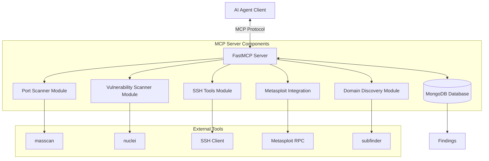

# Red-team-mcp
An MCP (Model Context Protocol) server for AI agents to use during red teaming exercises.

## Overview
This server provides resources and tools for AI agents to access during red teaming scenarios. It implements the Model Context Protocol to allow AI agents to retrieve information, access tools, and perform actions needed for security testing and evaluation.

## Architecture



## Components

### 1. Port Scanner
- Integrates with masscan for high-speed port scanning
- Allows AI agents to discover open ports and services on target networks
- Configurable scan parameters (IP ranges, port ranges, scan rate)
- Results parsing and formatting for agent consumption

### 2. Vulnerability Scanner
- Integrates with Nuclei for vulnerability detection
- Supports custom templates and severity filtering
- Stores results in MongoDB for fast searching

### 3. SSH Tools
- SSH command execution with credential authentication
- SSH brute force capabilities with username/password lists
- Results stored with host and port information

### 4. Metasploit Integration
- **Exploit Database**: Pre-populated MongoDB collection with all Metasploit exploits
- **Fast Search**: Search exploits by platform, CVE, rank, author, or keywords
- **Exploit Execution**: Execute exploits against targets with payload configuration
- **Live Querying**: Real-time exploit listing from Metasploit RPC server

## Implementation Plan
1. Set up basic MCP server structure
2. Implement masscan integration with parameter validation
3. Create result parsing and storage mechanisms
4. Add additional components (forthcoming)
5. Implement logging and monitoring
6. Build permission and boundary systems

## Todos
- [x] Add nuclei scanner
- [x] Add SSH scanner
- [x] Add Metasploit integration
- [x] Implement fully asynchronous FastMCP server
- [ ] Add tests
- [ ] Prompt for step by step hacking of a machine. (See agents/simple_agent.py)


## Setup

### installing 3rp party tools

The setup is depending on the following tools
 - mongodb
 - nuclei
 - 


### Exploit Database Setup
To enable fast exploit searching, populate the Metasploit exploits database:

1. **Prerequisites**:
   - Metasploit Framework installed
   - MongoDB running on localhost:27017
   - Metasploit RPC server running: `msfrpcd -P msf -a 127.0.0.1`
   - Python dependencies: `pip install pymetasploit3`

2. **Populate Database**:
   ```bash
   python scripts/setup_exploits_db.py
   ```

3. **Test Setup**:
   ```bash
   python scripts/test_exploits_db.py
   ```

This creates a searchable database of all Metasploit exploits with metadata including:
- CVE references
- Platform information
- Exploit rank and author
- Compatible payloads
- Required options

## Usage

### Exploit Search Examples
```python
# Search Windows SMB exploits
search_exploits_fast(platform='windows', search_term='smb')

# Find EternalBlue exploit
search_exploits_fast(cve='CVE-2017-0144')

# Get high-quality exploits
search_exploits_fast(rank='excellent')

# Search by author
search_exploits_fast(author='hdm')
```

## Development
Details on extending the server with new tools and resources will be added.
